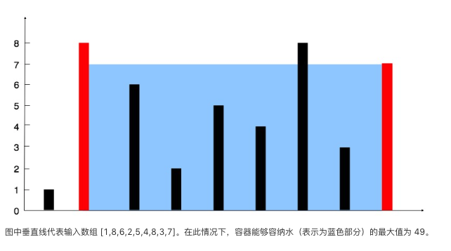
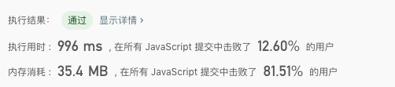
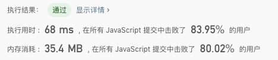

## 11.盛最多水的容器

**题目描述：** 

> 给你 n 个非负整数 a1，a2，...，an，每个数代表坐标中的一个点 (i, ai) 。在坐标内画 n 条垂直线，垂直线 i 的两个端点分别为 (i, ai) 和 (i, 0)。找出其中的两条线，使得它们与 x 轴共同构成的容器可以容纳最多的水。
>
> 说明：你不能倾斜容器，且 n 的值至少为 2。
>


**示例 1：**




**实例 2：**

``` 
输入：[1,8,6,2,5,4,8,3,7]
输出：49
```


**解法一：**

- 解题思路

  - 根据题目可知：容器的计算 = (index2 - index1) * min(item1, item2)
  - 思路：双层遍历，从 0 开始遍历匹配计算容器面积，然后求出最大值

- 代码

  ``` javascript
  /**
   * @param {number[]} nums
   * @return {number}
   */
  var maxArea = function(height) {
  	var len = height.length;
  	var maxSize = 0;
    for (let i = 0; i < len; i++) {
      for (let j = i + 1; j < len; j++) {
      	maxSize = Math.max(maxSize, (j - i) * Math.min(height[i], height[j]))
      }
    }
    return maxSize;
  };
  ```

- 测试结果

  

- 算法分析

  - 时间复杂度: `O(n²)`
  - 空间复杂度: `O(1)`
  - 逻辑复杂度: `O(n)`


**解法二（借鉴而来）**

- 解题思路

  - 由于面积取决于边长短的那一端，假设为m，所以要想得到比当前更大的面积，边长短的那一端必须舍弃，因为如果不舍弃，高最大就是m，而随着指针的移动宽会一直减小，面积只会越来越小。
  - 从坐标两端开始进行计算容器大小（双指针），舍弃高度矮的指标，然后得出容器面积最大值

- 代码

  ``` javascript
  /**
   * @param {number[]} nums
   * @return {number}
   */
  var maxArea = function(height) {
    var i = 0, j = height.length - 1, maxSize = 0;
    while(i < j) {
      maxSize = Math.max(maxSize, (j - i) * (Math.min(height[i], height[j])));
      if (height[i] < height[j]) {
      	i++
      } else {
      	j--;
      }
    }
    return maxSize;
  }
  ```

- 测试结果

  

- 算法分析

  - 时间复杂度: `O(n)`
  - 空间复杂度: `O(1)`
  - 逻辑复杂度: `O(n)`
