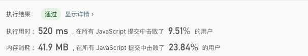
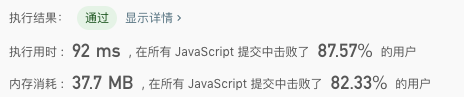

## 3.无重复字符的最长子串

**题目描述：** 

> 给定一个字符串，请你找出其中不含有重复字符的 最长子串 的长度。

**示例 1：**

``` 
输入: "abcabcbb"
输出: 3 
解释: 因为无重复字符的最长子串是 "abc"，所以其长度为 3。
```

**示例 2：**

``` 
输入: "bbbbb"
输出: 1
解释: 因为无重复字符的最长子串是 "b"，所以其长度为 1。
```

**示例 3：**

``` 
输入: "pwwkew"
输出: 3
解释: 因为无重复字符的最长子串是 "wke"，所以其长度为 3。
     请注意，你的答案必须是 子串 的长度，"pwke" 是一个子序列，不是子串。
```


**解法一：**

- 解题思路
  - 直接双层递归查询无重复字符串最大的长度

- 代码

  ``` javascript
  /**
   * @param {string} s
   * @return {number}
   */
  var lengthOfLongestSubstring = function (s) {
    var maxLength = 0;
    for (let i = 0; i < s.length; i++) {
      let tempArr = [];
      for (let j = i; j < s.length; j++) {
        if (!tempArr.includes(s[j])) {
          tempArr.push(s[j]);
        } else {
          if (maxLength < tempArr.length) {
            maxLength = tempArr.length;
          }
          break;
        }

        if (j === (s.length - 1) && maxLength < tempArr.length) {
          maxLength = tempArr.length;
        }
      }
    }
    return maxLength
  }
  ```

- 测试结果

  

- 算法分析

  - 时间复杂度: `O(n²)`
  - 空间复杂度: `O(n)`
  - 逻辑复杂度: `O(n²)`

- 总结

  - 暴力破解法太过于无脑且消耗性能


**解法二（借鉴而来）**

- 解题思路

  - 设置一个左游标，记录不重复子字符串的在整个字符串中的左起始位置，依次循环整个str，当找到重复字符时候，左游标右移，移动的距离是，当前左游标加子字符串中找到重复字符的位置

- 代码

  ``` javascript
  /**
   * @param {number[]} nums
   * @return {number}
   */
  var lengthOfLongestSubstring = function(s) {
    if (!s.length) return 0
    let maxLength = 0;
    let tempStr = '';
    let left = 0;

    for (let i = 0 ; i < s.length ; i++) {
        if (tempStr.includes(s[i])) {
            left += (s.slice(left, i).indexOf(s[i]) + 1);
            continue;
        }
        tempStr = s.slice(left, i + 1);
        maxLength = Math.max(maxLength, tempStr.length)
    }
    return maxLength
  };
  ```

- 测试结果

  

- 算法分析

  - 时间复杂度: `O(n)`
  - 空间复杂度: `O(1)`
  - 逻辑复杂度: `O(n)`
